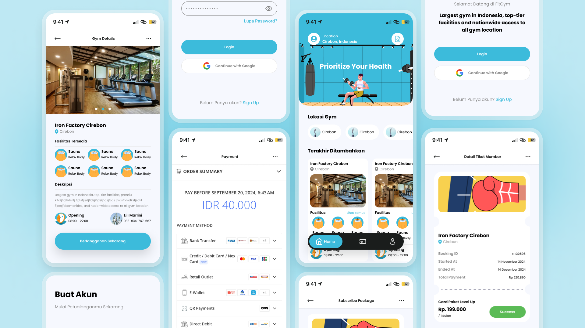

# 🏋️‍♀️ KitaBugar: Gym & Fitness Membership App 

**KitaBugar** adalah aplikasi seluler yang dirancang untuk memudahkan pengguna dalam melakukan pendaftaran keanggotaan gym dan pembayaran secara online. Pengguna dapat memilih paket keanggotaan, menyelesaikan pembayaran digital, dan mendapatkan tiket keanggotaan digital.

Aplikasi ini bertujuan untuk menyederhanakan proses administratif dan memberikan pengalaman yang efisien bagi pengguna untuk bergabung dengan gym.

## 💻 Fitur Utama

### Aplikasi Mobile
- 🔑 Registrasi dan Pendaftaran Keanggotaan
- 💳 Pembayaran Digital
- 📩 Tiket Keanggotaan Digital

### Website Admin
- 📊 Dashboard Utama
- 🏋️‍♀️ Manajemen Gym
- 💳 Manajemen Paket Keanggotaan
- 👥 Manajemen Keanggotaan
- 💸 Pengelolaan Pembayaran

## 🤖 Teknologi yang Digunakan

- **Platform**: Android (Pengguna) dan Website (Admin)
- **Backend**: -
- **Database**: -
- **Frontend**: React.js, Tailwind CSS
- **Pembayaran**: Integrasi dengan Xendit
- **Arsitektur**: Microservices

## 🧑‍💻 Kontributor

Proyek ini dikembangkan oleh:

- **Ade Oktaviano Arrahman[@novadeta](https://github.com/novadeta)**
- **Wahyudi [@Uwayxt](https://github.com/uwayxt)**
- **Audrey Valencia Kartono [@Audrey ](https://github.com/)**

## 🚀 Mulai

Untuk menjalankan proyek KitaBugar secara lokal, ikuti langkah-langkah berikut:

### Aplikasi Web Admin (Next.js)

1. Kloning repo:

   ```

   git clone https://github.com/username/kitabugar.git

   ```

2. Masuk ke direktori web admin:

   ```

   cd kitabugar/admin

   ```

3. Instal dependensi:

   ```

   npm install

   ```

4. Jalankan server:

   ```

   npm run dev

   ```

5. Buka aplikasi admin di browser: http://localhost:3000

### Aplikasi Mobile (Flutter)

1. Masuk ke direktori aplikasi mobile:

   ```

   cd kitabugar/mobile

   ```

2. Instal dependensi:

   ```

   flutter pub get

   ```

3. Jalankan aplikasi:

   ```

   flutter run

   ```

4. Aplikasi akan terbuka di emulator atau perangkat yang terhubung.

Pastikan Anda telah menginstal Flutter dan mempersiapkan lingkungan pengembangan Flutter sebelum menjalankan langkah-langkah di atas.

Setelah mengikuti langkah-langkah di atas, Anda dapat mulai mengembangkan dan menguji aplikasi KitaBugar secara lokal. Jangan ragu untuk mempelajari dokumentasi lebih lanjut jika Anda membutuhkan bantuan.

## 📄 Lisensi

Proyek ini dilisensikan di bawah [MIT License](LICENSE).